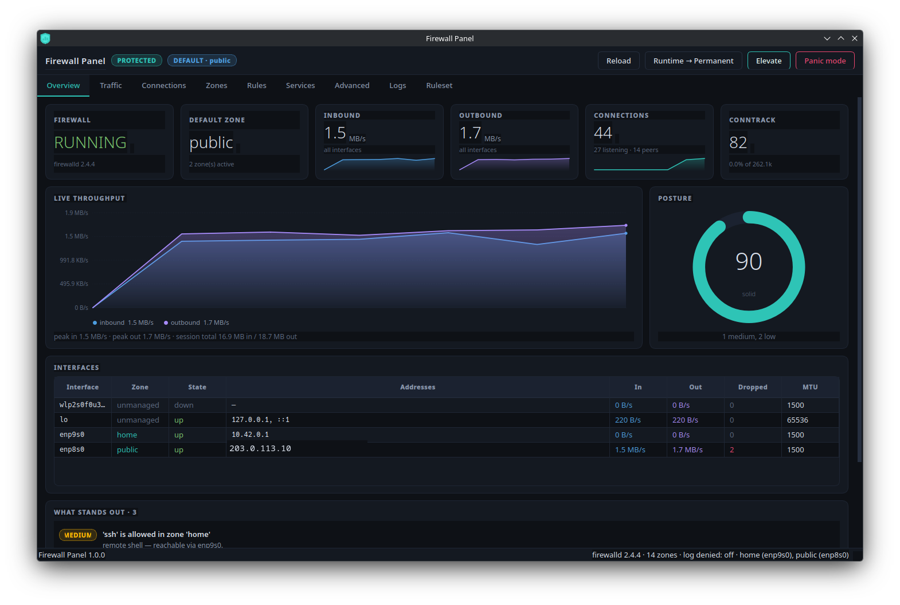
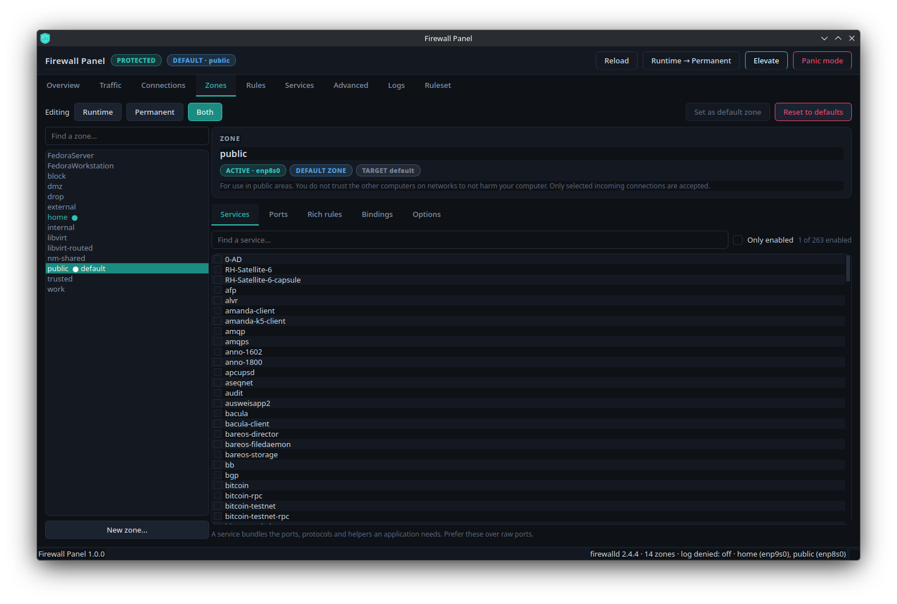
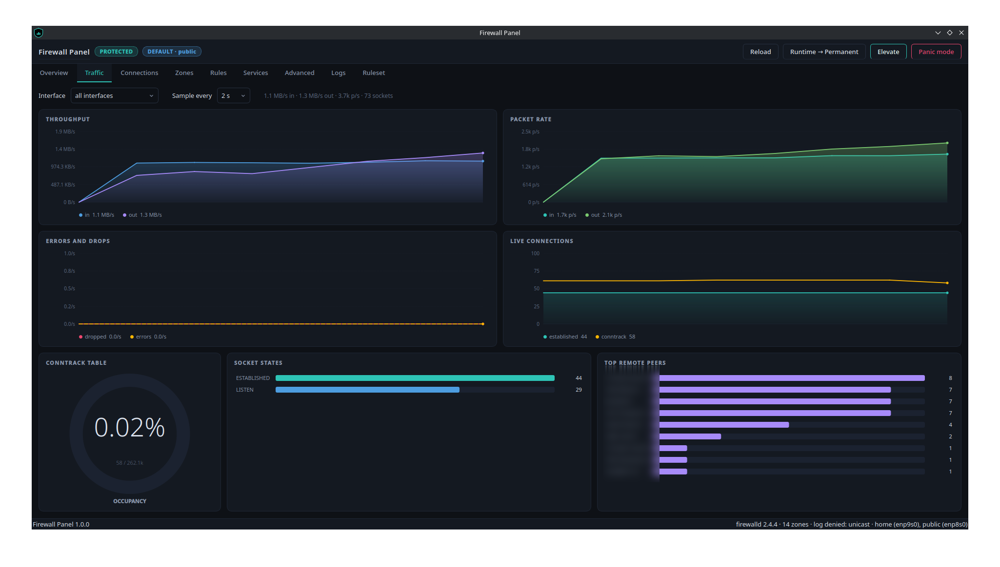

# Firewall Panel

**An advanced firewalld control panel for the Linux desktop** — live traffic
graphs, the socket table, a complete zone editor, and the compiled nftables
ruleset, with a tray icon that shows the firewall's state at a glance.



`fwpanel` talks to firewalld over D-Bus, exactly as the official
`firewall-config` does. Reading the firewall needs no authentication; anything
that *changes* it goes through polkit, so you get your desktop's normal
authentication dialog and nothing runs as root that does not have to.

---

## Table of contents

- [Why](#why)
- [Features](#features)
- [Requirements](#requirements)
- [Installation](#installation)
  - [Dependencies by distribution](#dependencies-by-distribution)
  - [Install](#install)
  - [What gets installed where](#what-gets-installed-where)
  - [Running from source without installing](#running-from-source-without-installing)
- [Running](#running)
- [The privilege model](#the-privilege-model)
- [Runtime vs permanent](#runtime-vs-permanent)
- [Things worth knowing](#things-worth-knowing)
- [Troubleshooting](#troubleshooting)
- [Uninstall](#uninstall)
- [Architecture](#architecture)
- [Development](#development)
- [Compatibility](#compatibility)
- [Licence](#licence)

---

## Why

`firewall-config` tells you what is *configured*. It does not tell you what is
*happening*: which sockets are open right now, what is being dropped, whether
the rule you added five minutes ago actually survives a reload, or what
firewalld really compiled into nftables.

`fwpanel` answers those questions in one window, and puts the answer in your
system tray so you do not have to open a window to know the firewall is up.

## Features

| Tab | What it does |
|---|---|
| **Overview** | Daemon state, default zone, live throughput, per-interface table, and a ranked posture assessment with a score. |
| **Traffic** | Throughput, packet rate, errors and drops, and connection counts — aggregated or per interface. Conntrack occupancy, socket-state and top-peer breakdowns. |
| **Connections** | The live socket table with process names, protocol/state filters, background reverse DNS, and a right-click path straight to a block rule. |
| **Zones** | The full zone editor: services, ports, protocols, source ports, forward ports, rich rules, interface and source bindings, target, masquerade, ICMP blocks. |
| **Rules** | Every rule in the firewall flattened into one auditable list — *what is actually exposed on this machine?* |
| **Services** | The ~260 service definitions firewalld ships, the ports each one opens, and which zones use it. |
| **Advanced** | IP sets, direct rules, and inter-zone policies — the parts a zone-by-zone review misses. |
| **Logs** | A live tail of the kernel and firewalld journals with a denied-packets-per-second timeline. |
| **Ruleset** | The nftables ruleset firewalld actually compiled, with live per-chain packet counters. |

Beyond the tab list:

- **Posture analysis.** Findings are ranked by real exposure — a permissive
  zone that no interface is bound to is not treated like one that is. It tells
  you *why* something matters, not just that it is set.
- **Drift detection.** Zones whose runtime state differs from what is on disk
  are flagged in the title bar, in the zone list, and per rule, so a change you
  forgot to save cannot quietly disappear on the next reload.
- **Rich rule builder.** A guided form that generates firewalld rich-rule
  syntax and validates it with firewalld's own parser before saving. You can
  also edit the generated rule directly.
- **Block an address in two clicks.** Right-click any connection or denied
  packet, choose a zone, optionally set an expiry, done.
- **Tray-first.** The shield is teal when protected, red in panic mode, grey
  when firewalld is unreachable. The tooltip carries live throughput and
  connection counts.





## Requirements

- **firewalld** running (1.0 or newer recommended; developed against 2.4)
- **Python** 3.9+
- **PySide6** (Qt 6 bindings)
- **psutil**
- the **python firewall bindings** that ship with firewalld
- **dbus-python** and **PyGObject**
- **polkit** with `pkexec` and a running authentication agent
- a desktop with a **StatusNotifierItem** tray host — KDE Plasma out of the
  box; GNOME needs the AppIndicator extension

Works on both Wayland and X11.

## Installation

### Dependencies by distribution

<details open>
<summary><b>Fedora / RHEL / Rocky / AlmaLinux</b></summary>

```bash
sudo dnf install python3-pyside6 python3-psutil python3-firewall \
                 python3-dbus python3-gobject-base polkit firewalld
```
</details>

<details>
<summary><b>Debian / Ubuntu / Linux Mint / Pop!_OS</b></summary>

Debian splits PySide6 into one package per Qt module, so the four `fwpanel`
uses must be named individually:

```bash
sudo apt install python3-pyside6.qtcore python3-pyside6.qtgui \
                 python3-pyside6.qtwidgets python3-pyside6.qtnetwork \
                 python3-psutil python3-firewall python3-dbus \
                 python3-gi pkexec firewalld
```

On releases older than Debian 13 / Ubuntu 24.04, `pkexec` lives in
`policykit-1` instead of its own package.
</details>

<details>
<summary><b>Arch / Manjaro / EndeavourOS</b></summary>

```bash
sudo pacman -S pyside6 python-psutil python-firewall python-dbus \
               python-gobject polkit firewalld
```
</details>

<details>
<summary><b>openSUSE Tumbleweed / Leap</b></summary>

```bash
sudo zypper install python3-pyside6 python3-psutil python3-firewall \
                    python3-dbus-python python3-gobject polkit firewalld
```
</details>

If firewalld is not running yet:

```bash
sudo systemctl enable --now firewalld
```

> The installer checks dependencies by **importing** them rather than by
> querying the package manager, because the import is what actually has to
> work. If something is missing it prints the exact install command for your
> distribution and stops.

### Install

```bash
git clone https://github.com/dnlsplnd/fwpanel.git
cd fwpanel
./install.sh
```

Run it as your normal user — **not** with `sudo`. It elevates once, for the
file installation, and then enables the user service unprivileged.

The installer uses `sudo` when it has a terminal to prompt in, and falls back
to `pkexec` (a graphical polkit dialog) when it does not, so it works from a
shell and from a file manager alike.

### What gets installed where

| Path | Purpose |
|---|---|
| `/usr/lib/fwpanel/` | The Python package |
| `/usr/bin/fwpanel` | Launcher |
| `/usr/libexec/fwpanel-helper` | Optional read-only privileged helper |
| `/usr/share/polkit-1/actions/org.fwpanel.helper.policy` | Polkit action for the helper |
| `/usr/share/applications/org.fwpanel.Panel.desktop` | Desktop entry |
| `/usr/share/icons/hicolor/scalable/apps/fwpanel.svg` | Icon |
| `/usr/lib/systemd/user/fwpanel.service` | systemd **user** unit |

Nothing is written outside these paths, and your firewalld configuration is
never modified by the installer.

### Running from source without installing

```bash
python3 -m fwpanel
```

Everything works except the **Elevate** button, which needs the helper and its
polkit action installed. The panel finds a helper in `./helper/` when running
from a source tree, but polkit will not authorise an unregistered path.

## Running

The installer enables a **systemd user service** that starts the panel hidden
in the tray with your graphical session:

```bash
systemctl --user status  fwpanel.service
systemctl --user restart fwpanel.service
systemctl --user stop    fwpanel.service
journalctl --user -u fwpanel.service -f
```

It is a *user* service, not a system one, on purpose: a tray applet needs your
Wayland/X11 socket and your session's polkit agent, neither of which a system
daemon has. It starts and stops with your session.

Click the tray shield to open the window; closing the window hides it back to
the tray. Launching `fwpanel` again raises the running instance rather than
starting a second copy.

```
fwpanel              # open the window
fwpanel --hidden     # start in the tray only (what the service uses)
fwpanel --no-tray    # plain window, no tray icon
fwpanel --version
```

## The privilege model

Three levels, deliberately separated:

| Action | Authentication |
|---|---|
| Reading firewalld's configuration and state | **None.** firewalld's own polkit policy allows `…FirewallD1.info` and `…config.info` for any active local session. |
| Changing anything in the firewall | **A polkit prompt**, cached briefly (`auth_admin_keep`) — the same behaviour as `firewall-config`. |
| Conntrack, the raw nftables ruleset, socket ownership for other users | **Optional.** The *Elevate* button starts the helper via `pkexec`, once per session. |

The helper is **read-only by design**:

- It accepts a fixed set of command *names* on stdin as JSON. Nothing the GUI
  types is ever passed to it as an argument or interpolated into a path.
- It never writes to the firewall. Every mutation goes through firewalld's own
  polkit-checked D-Bus API, from the unprivileged GUI.
- It exits as soon as its stdin closes, so it cannot outlive the panel.
- It refuses to run if it is not root, so it cannot be misused as a helper for
  something else.

You never have to elevate. Without it you simply see your own processes rather
than everyone's, and the Ruleset tab stays empty.

## Runtime vs permanent

firewalld keeps two configurations: the one running now, and the one on disk.
`fwpanel` never hides which one you are touching.

- The **Zones** tab has a Runtime / Permanent / **Both** selector.
- Every rule is labelled `runtime only`, `permanent only` or
  `runtime + permanent`, colour-coded, so drift is visible in place.
- A badge in the title bar counts zones that differ from disk.
- **Runtime → Permanent** saves the running configuration to disk.
- **Reload** re-applies the disk configuration and **discards unsaved runtime
  changes** — you are asked to confirm first.

## Things worth knowing

- **Panic mode** drops every packet in both directions, including remote
  sessions into this machine. It is confirmed before it is enabled and turns
  the tray icon red.
- **Denied-packet logging is off by default in firewalld**, so the Logs
  timeline stays empty until you set *Log denied packets* to `unicast` or `all`
  from that tab. `unicast` is usually the right choice — `all` adds broadcast
  and multicast, which is very chatty on a normal LAN.
- **Changing a zone's target requires a reload.** It is a permanent-only
  setting in firewalld; the panel tells you when this applies to you.
- **The posture score is opinionated, not authoritative.** A "loose" score on a
  laptop that shares its connection is expected. Read the findings, not the
  number.

## Troubleshooting

**No tray icon.**
Confirm a tray host exists — on Plasma, that the System Tray widget is on your
panel; on GNOME, that the AppIndicator extension is enabled. The panel retries
for ~90 seconds after start, because a user service routinely wins the race
against the desktop shell. Check `systemctl --user status fwpanel.service`.

**The service will not start.**

```bash
journalctl --user -u fwpanel.service -n 50
```

If it reports a missing module, a dependency is not installed — see
[Dependencies by distribution](#dependencies-by-distribution).

**"firewalld unavailable" in the title bar.**

```bash
systemctl status firewalld
sudo systemctl enable --now firewalld
```

**The Logs tab is empty.**
Either denied logging is off (set it from that tab), or your user cannot read
the kernel journal:

```bash
sudo usermod -aG systemd-journal "$USER"   # log out and back in
```

**Every change asks for a password.**
That is polkit doing its job. The grant is cached for a few minutes per
session. To change the policy, edit
`/usr/share/polkit-1/actions/org.fedoraproject.FirewallD1.policy` or add a
local rule under `/etc/polkit-1/rules.d/` — at your own risk.

**Elevate does nothing / immediately fails.**
The helper must be installed at `/usr/libexec/fwpanel-helper` with its polkit
action registered. Verify with:

```bash
pkaction --action-id org.fwpanel.helper.read
```

## Uninstall

```bash
./uninstall.sh
```

This stops and disables the user service and removes every installed file.
**Your firewalld configuration is not touched.** Window geometry is remembered
in `~/.config/fwpanel/` — delete it for a clean slate.

## Architecture

```
fwpanel/
├── fwpanel/
│   ├── app.py               application wiring, single-instance guard, lifecycle
│   ├── analysis.py          posture findings and runtime/permanent drift
│   ├── context.py           the three data sources handed to every tab
│   ├── util.py              formatting and validation helpers
│   ├── backend/
│   │   ├── firewalld.py     threaded D-Bus client (GLib pumped from Qt)
│   │   ├── netstats.py      unprivileged kernel sampling thread
│   │   └── helper_client.py client side of the pkexec helper
│   └── ui/                  theme, charts, widgets, dialogs, tabs, tray
├── helper/fwpanel-helper    privileged read-only helper
├── data/                    desktop entry, systemd unit, polkit policy, icon
├── install.sh / uninstall.sh
└── docs/screenshots/
```

Three design decisions worth calling out:

**The D-Bus client owns its own thread** and drives GLib's default main context
from a Qt timer. firewalld's Python client is built on dbus-python and GLib;
pumping GLib from Qt lets firewalld's async signals arrive without a second
event loop fighting Qt's, and keeps every D-Bus call off the GUI thread.

**Charts are painted directly with `QPainter`** rather than pulled from a
plotting library. That keeps runtime dependencies to PySide6 and psutil, and
lets the charts share the panel's palette exactly.

**Requests cross threads as queued signals, not `QMetaObject::invokeMethod`.**
PySide6's `Q_ARG` cannot marshal Python containers, so signal/slot connections
with `object` payloads are the reliable route.

## Development

```bash
git clone https://github.com/dnlsplnd/fwpanel.git
cd fwpanel
python3 -m fwpanel            # run against the live firewalld
```

Useful while working on the UI:

```bash
QT_QPA_PLATFORM=offscreen python3 -m fwpanel --no-tray   # headless smoke test
python3 -m compileall -q fwpanel helper/fwpanel-helper
```

There is no build step and no code generation — it is a plain Python package.
After changing anything under `fwpanel/`, re-run `./install.sh` to update the
installed copy, then `systemctl --user restart fwpanel.service`.

## Compatibility

Developed and tested on:

| | |
|---|---|
| Distribution | Fedora 44 |
| Desktop | KDE Plasma 6.7.4 (Wayland) |
| Python | 3.14 |
| PySide6 | 6.11.1 |
| firewalld | 2.4.4 |

Nothing in the code is Fedora- or KDE-specific: it needs firewalld, a polkit
agent, and a StatusNotifierItem tray host. Package names for other
distributions are listed above and were checked against their package
databases, but only Fedora has been exercised end to end. Reports from other
distributions are welcome.

## Licence

GPL-3.0-or-later. See [LICENSE](LICENSE).

firewalld itself is GPL-2.0-or-later and is not bundled here — `fwpanel` is a
client for it.
